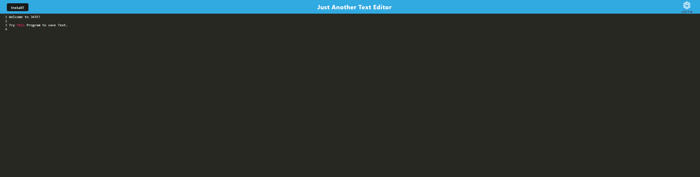

# PWA: Just Another Text Editor

## Link

## Description
The purpose of this project is to finish the development of a text editor using progressive web application concepts.  Code and a file structure for the text editor itself has already been provided, referred to as "Just Another Text Editor" (JATE).

The program will be able to be built and ran through the terminal by invoking "npm run build" and "npm run start".  Upon building the "dist" folder will be created with bundled JavaScript files, generated HTML, service worker, and manifest files.  All code will be compatible with all next-gen JavaScript by utilziing the Bable Webpack.  An indexDB will be utilzied to save and display the user's text using CRUD operations.  The user will also have the option to install the applicaiton locally on their machine, by simply clicking an install button.  

## Steps Taken

1.  Set up WebPack with the following plugins:

* HtmlWebpackPlugin
* InjectManifest
* WebpackPwaManifest

2.  Set up WebPack with module rules to accomodate CSS & Bable

3.  Created putDb and getDb CRUD operations in client/src/js/database.js to save and retrive text

4.  Added handlers in client/src/js/install.js to set-up install functionallity

5.  Registered route in client/src-sw.js to allow asset caching

6.  Deployed to Heroku

## Picture

